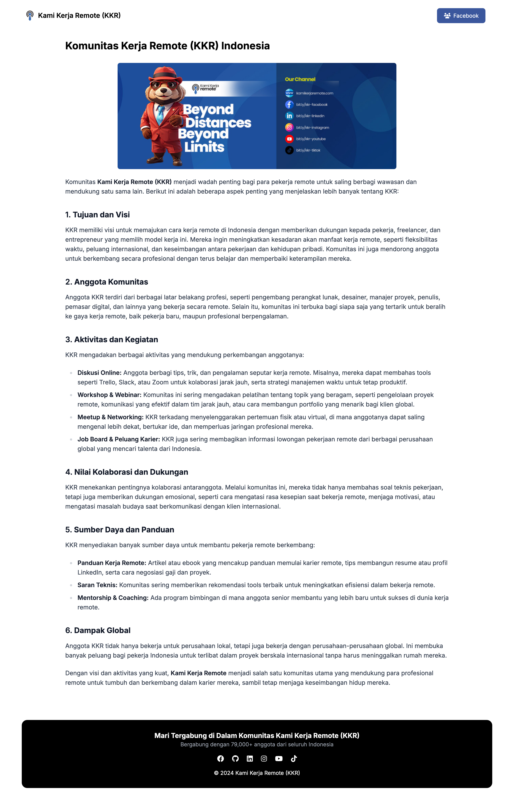

# Kami Kerja Remote (KKR)

Kami Kerja Remote adalah sebuah platform yang menyediakan informasi lowongan kerja remote di Indonesia. Kami Kerja Remote dibangun menggunakan SvelteKit dan TailwindCSS.

## 🚀 Installasi

### 👨‍💻 Manual
1. Install paket npm : `pnpm i`
2. Bangun asset : `pnpx grunt build`
3. Jalankan server : `pnpm run dev`

## ⚒️ Perpusatakaan
- [GruntJS](https://gruntjs.com/)
- [JamesIves/github-pages-deploy-action](https://github.com/JamesIves/github-pages-deploy-action)
- [MomentJS](https://momentjs.com/)
- [SvelteKit](https://kit.svelte.dev/)
- [TailwindCSS](https://tailwindcss.com/)
